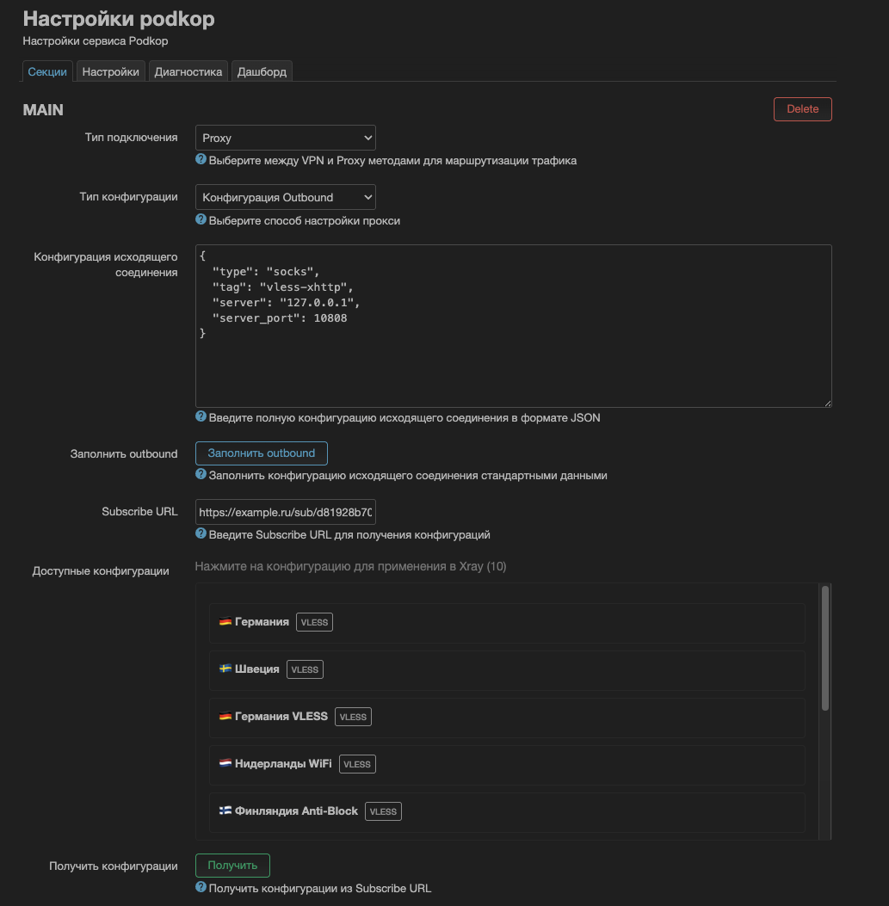

# luci-podkop-subscribe



Расширение LuCI для Podkop, добавляющее функциональность Subscribe URL для получения и управления конфигурациями прокси.

## Поддерживаемые протоколы

| Протокол | Connection URL | Outbound Config | URLTest | Selector |
|----------|----------------|-----------------|---------|----------|
| VLESS | ✅ | ✅ | ✅ | ✅ |
| VLESS+XHTTP | ❌ | ✅ | ❌ | ❌ |
| VLESS+REALITY | ❌ | ✅ | ❌ | ❌ |
| Shadowsocks (SS) | ✅ | ✅ | ✅ | ✅ |
| Trojan | ✅ | ✅ | ✅ | ✅ |
| Hysteria2 (hy2) | ✅ | ✅ | ✅ | ✅ |
| SOCKS4/5 | ✅ | ✅ | ✅ | ✅ |

**Примечание:** XHTTP и REALITY транспорты работают только в режиме Outbound Config через Xray.

## Быстрая установка

Одной командой устанавливается всё необходимое:

```bash
sh <(wget -O - https://raw.githubusercontent.com/mr-Abdrahimov/luci-podkop-subscribe/main/install.sh)
```

**Интерактивная установка:**
- Скрипт спросит, нужно ли устанавливать Xray (для поддержки XHTTP в режиме Outbound)
- Если выбрать "нет" (n), Xray не будет установлен
- Режим Outbound Config будет недоступен без Xray
- Все остальные режимы (Connection URL, URLTest, Selector) работают без Xray

**Что устанавливается автоматически:**
- ✅ luci-app-podkop-subscribe плагин
- ✅ Все необходимые CGI скрипты и файлы интерфейса
- ⚙️ xray-core пакет (опционально, по выбору пользователя)
- ⚙️ Xray init скрипт `/etc/init.d/xray` (если выбран Xray)
- ⚙️ Автозапуск службы Xray (если выбран Xray)

## Удаление

```bash
sh <(wget -O - https://raw.githubusercontent.com/mr-Abdrahimov/luci-podkop-subscribe/main/uninstall.sh)
```

## Описание

Этот плагин расширяет интерфейс LuCI Podkop функцией Subscribe, которая позволяет пользователям:

- Вводить Subscribe URL, содержащий конфигурации в формате base64
- Получать конфигурации из Subscribe URL одним нажатием кнопки
- Просматривать доступные конфигурации в удобном списке с указанием протокола
- **Автоматически сохранять и восстанавливать список конфигураций** (не нужно повторно нажимать "Получить")
- **Подсвечивать активные подключения во всех режимах**:
  - Connection URL: подсвечивается текущий выбранный прокси
  - Outbound Config: подсвечивается конфигурация, применённая к Xray
  - URLTest/Selector: подсвечиваются все выбранные конфигурации в группе
- Выбирать и применять конфигурации к настройкам прокси Podkop или напрямую к Xray
- Автоматически сохранять Subscribe URL в конфигурации (сохраняется при Save & Apply)
- Использовать URLTest для автоматического выбора лучшего прокси
- Использовать Selector для ручного переключения между прокси
- Быстро заполнять Outbound конфигурацию одной кнопкой
- Поддержка светлой и тёмной темы LuCI

## Режимы работы

Плагин поддерживает 4 режима конфигурации прокси:

| Режим | Описание | Использование |
|-------|----------|---------------|
| **Connection URL** | Простой выбор одной конфигурации | Применяет прокси напрямую к Podkop |
| **Outbound Config** | Применение конфигурации к Xray | Для XHTTP, REALITY и других сложных конфигураций |
| **URLTest** | Автоматический выбор по задержке | Множественный выбор + автотестирование |
| **Selector** | Ручное переключение между прокси | Множественный выбор + ручное управление |

### Быстрое сравнение режимов

```
Connection URL  → Одна конфигурация → Podkop напрямую
Outbound Config → Одна конфигурация → Xray → Podkop через SOCKS
URLTest         → Несколько конфигураций → Автовыбор лучшей
Selector        → Несколько конфигураций → Ручное переключение
```

---

## 📋 Режим 1: Connection URL

Режим "Connection URL" позволяет получать конфигурации из Subscribe URL и применять их напрямую к настройкам прокси Podkop.

### Возможности

- **Поле Subscribe URL**: Поле ввода для ввода ссылок подписки
- **Получить конфигурации**: Кнопка для получения и парсинга конфигураций
- **Список конфигураций**: Отображает доступные конфигурации с их названиями и протоколами
- **Выбор одним кликом**: Клик по конфигурации применяет её к настройкам прокси Podkop
- **Защита XHTTP**: Конфигурации с XHTTP транспортом помечаются и блокируются (требуется режим Outbound)
- **Автосохранение**: Subscribe URL автоматически сохраняется и восстанавливается
- **Умная видимость**: Список конфигураций появляется только когда Тип подключения установлен в "Proxy"

### Как использовать

1. Перейдите в: **LuCI -> Services -> Podkop**
2. Установите **Connection Type** в **"Proxy"**
3. Установите **Configuration Type** в **"Connection URL"**
4. В поле **"Subscribe URL"** вставьте ссылку на подписку (формат base64)
5. Нажмите кнопку **"Получить"**
6. В списке ниже появятся доступные конфигурации с их названиями и протоколами
7. Кликните по нужной конфигурации — она будет применена к полю "Proxy Configuration URL"
8. Нажмите **"Save & Apply"** для сохранения настроек

### Как это работает

1. Пользователь вводит Subscribe URL в поле "Subscribe URL"
2. Нажимает кнопку "Получить"
3. Плагин получает содержимое URL (данные в формате base64)
4. Декодирует данные base64 и парсит прокси URLs (vless://, ss://, trojan://, hy2://)
5. Отображает конфигурации в списке с протоколами и предупреждениями (если есть XHTTP)
6. Пользователь кликает по конфигурации для применения её к Podkop
7. Subscribe URL автоматически сохраняется при нажатии "Save & Apply"

---

## 🚀 Режим 2: Outbound Config (Xray)

Режим "Outbound Config" позволяет получать конфигурации из Subscribe URL и применять их напрямую к Xray, минуя настройки Podkop. Это особенно полезно для работы с VLESS+XHTTP+REALITY.

### Требования

✅ **Всё устанавливается автоматически!** При запуске `install.sh` автоматически устанавливаются:
- xray-core пакет
- Xray init скрипт (`/etc/init.d/xray`)
- Автозапуск службы Xray

Больше ничего делать вручную не нужно!

### Возможности

- **Кнопка "Заполнить outbound"**: Быстро заполняет конфигурацию Podkop для подключения к Xray
- **Поле Subscribe URL**: Поле ввода для Subscribe URL
- **Получить конфигурации**: Кнопка для получения списка конфигураций
- **Список конфигураций**: Отображает доступные конфигурации с протоколами
- **Прямое применение к Xray**: Клик по конфигурации:
  - Парсит VLESS/SS/Trojan/Hy2 URL и преобразует в конфигурацию Xray
  - Создает/обновляет файл `/etc/xray/config.json`
  - Автоматически перезапускает службу Xray
- **Поддержка всех параметров VLESS**: 
  - Поддержка типов сети: `tcp`, `ws`, `xhttp` и других
  - Поддержка безопасности: `tls`, `reality`
  - Поддержка параметров REALITY: `serverName`, `fingerprint`, `publicKey`, `shortId`, `spiderX`
  - Поддержка xhttpSettings: `host`, `path`, `mode`
  - Поддержка WebSocket: `path`, `host`

### Как использовать

1. Перейдите в: **LuCI -> Services -> Podkop**
2. Установите **Connection Type** в **"Proxy"**
3. Установите **Configuration Type** в **"Outbound Config"**
4. **СНАЧАЛА**: Нажмите кнопку **"Заполнить outbound"** 
   - Это заполнит поле "Outbound Configuration" в Podkop настройками для подключения к Xray
5. В поле **"Subscribe URL"** вставьте ссылку на подписку
6. Нажмите кнопку **"Получить"**
7. В списке ниже появятся доступные конфигурации
8. Кликните по нужной конфигурации:
   - Плагин автоматически сгенерирует конфигурацию Xray
   - Сохранит её в `/etc/xray/config.json`
   - Перезапустит службу Xray
9. Нажмите **"Save & Apply"** для сохранения настроек Podkop
10. Настройте маршрутизацию в Podkop (Geosite / Geoblock / Custom Rules) с Outbound: `vless-xhttp`

### Как это работает

1. Пользователь выбирает "Outbound Config" в поле "Configuration Type"
2. Нажимает кнопку **"Заполнить outbound"** - автоматически заполняется конфигурация:
   ```json
   {
     "type": "socks",
     "tag": "vless-xhttp",
     "server": "127.0.0.1",
     "server_port": 10808
   }
   ```
3. Вводит Subscribe URL в поле "Subscribe URL"
4. Нажимает кнопку "Получить"
5. Плагин получает и парсит конфигурации (vless://, ss://, trojan://, hy2://)
6. Отображает список конфигураций
7. При клике на конфигурацию:
   - Парсится URL и извлекаются все параметры (uuid, host, port, security, network и т.д.)
   - Генерируется полная конфигурация Xray в формате JSON
   - Сохраняется в `/etc/xray/config.json` со следующей структурой:
     - `log`: настройки логирования
     - `inbounds`: SOCKS прокси на порту 10808
     - `outbounds`: конфигурация прокси из выбранной ссылки, плюс `direct` и `block` outbounds
     - `routing`: правила маршрутизации для направления трафика через прокси
   - Автоматически перезапускается служба Xray командой `/etc/init.d/xray restart`
8. Subscribe URL автоматически сохраняется при нажатии "Save & Apply"

### Подключение Podkop к Xray

После применения конфигурации Xray будет доступен на `127.0.0.1:10808` через SOCKS5.

**Используйте кнопку "Заполнить outbound"** - она автоматически заполнит поле "Outbound Configuration" правильными настройками!

Или введите вручную в поле **"Outbound Configuration"**:

```json
{
  "type": "socks",
  "tag": "vless-xhttp",
  "server": "127.0.0.1",
  "server_port": 10808
}
```

Затем настройте маршрутизацию в Podkop (Geosite / Geoblock / Custom Rules) с Outbound: `vless-xhttp`.

### Проверка работы

```bash
# Проверка статуса Xray
/etc/init.d/xray status

# Проверка конфигурации
xray -test -config /etc/xray/config.json

# Тест подключения через Xray
curl --socks5 127.0.0.1:10808 https://ifconfig.me

# Просмотр логов
logread | grep xray | tail -20
```

---

## 🔄 Режим 3: URLTest (Auto-Select)

Режим "URLTest" автоматически выбирает лучший прокси на основе задержки (latency), периодически тестируя все выбранные серверы.

### Возможности

- **Автоматический выбор**: Автоматически выбирает сервер с наименьшей задержкой
- **Множественный выбор**: Выберите несколько конфигураций для тестирования
- **Периодическое тестирование**: Настраиваемый интервал проверки (30 сек - 5 мин)
- **Tolerance настройка**: Максимальная разница задержки для переключения (мс)
- **Счётчик выбора**: Показывает количество выбранных конфигураций
- **Визуальная индикация**: Выбранные конфигурации подсвечиваются

### Как использовать

1. Перейдите в: **LuCI -> Services -> Podkop**
2. Установите **Connection Type** в **"Proxy"**
3. Установите **Configuration Type** в **"URLTest"**
4. Настройте параметры URLTest:
   - **URLTest Check Interval**: Интервал проверки (по умолчанию 3 минуты)
   - **URLTest Tolerance**: Допустимая разница задержки (по умолчанию 50 мс)
   - **URLTest Testing URL**: URL для проверки доступности
5. В поле **"Subscribe URL"** вставьте ссылку на подписку
6. Нажмите кнопку **"Получить"**
7. **Выберите несколько конфигураций** кликая по ним (можно отменить повторным кликом)
8. Счётчик покажет количество выбранных конфигураций
9. Нажмите **"Save & Apply"** для сохранения
10. Podkop автоматически будет выбирать лучший сервер из списка

### Параметры

- **Check Interval**: Как часто проверять серверы (30s, 1m, 3m, 5m)
- **Tolerance**: Минимальная разница задержки для переключения (50-1000 мс)
- **Testing URL**: URL для проверки (Google, Cloudflare, Apple, Ubuntu)

---

## 🔀 Режим 4: Selector (Manual Select)

Режим "Selector" позволяет вручную переключаться между несколькими прокси серверами через API или интерфейс управления.

### Возможности

- **Ручное переключение**: Переключайтесь между серверами по необходимости
- **Множественный выбор**: Выберите несколько конфигураций для ротации
- **Без автотестирования**: Не создаёт фоновую нагрузку на серверы
- **Счётчик выбора**: Показывает количество выбранных конфигураций
- **Визуальная индикация**: Выбранные конфигурации подсвечиваются

### Как использовать

1. Перейдите в: **LuCI -> Services -> Podkop**
2. Установите **Connection Type** в **"Proxy"**
3. Установите **Configuration Type** в **"Selector"**
4. В поле **"Subscribe URL"** вставьте ссылку на подписку
5. Нажмите кнопку **"Получить"**
6. **Выберите несколько конфигураций** кликая по ним (можно отменить повторным кликом)
7. Счётчик покажет количество выбранных конфигураций
8. Нажмите **"Save & Apply"** для сохранения
9. Переключайтесь между серверами через API управления

### Отличия от URLTest

| Параметр | URLTest | Selector |
|----------|---------|----------|
| Выбор сервера | Автоматический | Ручной |
| Тестирование | Периодическое | Нет |
| Нагрузка на серверы | Есть | Нет |
| Переключение | По задержке | По команде |

---

### Формат конфигурации Xray

При использовании режима "Outbound Config" создается конфигурация следующего формата:

```json
{
  "log": { "loglevel": "warning" },
  "inbounds": [
    {
      "tag": "socks-local",
      "port": 10808,
      "listen": "127.0.0.1",
      "protocol": "socks",
      "settings": { "udp": true },
      "sniffing": {
        "enabled": true,
        "destOverride": ["tls", "http", "quic"]
      }
    }
  ],
  "outbounds": [
    {
      "tag": "proxy",
      "protocol": "vless",
      "settings": { ... },
      "streamSettings": { ... }
    },
    { "tag": "direct", "protocol": "freedom", "settings": {} },
    { "tag": "block", "protocol": "blackhole", "settings": { "response": { "type": "none" } } }
  ],
  "routing": {
    "rules": [
      {
        "type": "field",
        "inboundTag": ["socks-local"],
        "outboundTag": "proxy"
      }
    ]
  }
}
```

### Поддерживаемые параметры VLESS URL

Скрипт `podkop-xray-config` поддерживает следующие параметры из VLESS URL:

- **type**: Тип сети (`tcp`, `ws`, `xhttp`, и другие)
- **security**: Тип безопасности (`none`, `tls`, `reality`)
- **sni**: Server Name Indication (для TLS/REALITY)
- **fp**: Fingerprint (для TLS/REALITY)
- **pbk**: Public Key (для REALITY)
- **sid**: Short ID (для REALITY)
- **spx**: SpiderX (для REALITY)
- **flow**: Flow control (для VLESS)
- **path**: Путь (для WebSocket или xhttp)
- **host**: Хост (для WebSocket или xhttp)
- **mode**: Режим (для xhttp)

---

## Требования

### Обязательные (устанавливаются вручную)
- OpenWrt 24.x или новее
- luci-app-podkop (Podkop должен быть установлен до плагина)
  ```bash
  opkg update
  opkg install podkop
  ```

### Автоматически устанавливаются через install.sh
- ✅ wget (если не установлен)
- ✅ Все файлы плагина (CGI скрипты, JS файлы, ACL конфигурация)

### Опционально (устанавливается по выбору при установке)
- ⚙️ xray-core
- ⚙️ Xray init скрипт
- ⚙️ Автозапуск службы Xray

**Примечание:** Скрипт установки спросит, нужен ли вам Xray. Если вы не планируете использовать режим Outbound Config с XHTTP, можете отказаться от установки Xray.

### Встроенные в систему
- base64 (обычно включен в BusyBox)

## Протестировано на

- **Podkop**: v0.7.15 - v0.7.19
- **LuCI App**: v0.7.15 +
- **OpenWrt**: 24.10.4 - 24.10.6
- **Xray**: 25.1.30+

## Технические детали

### Frontend (JavaScript)
- **subscribe.js**: Основная логика UI
  - Обработка всех 4 режимов (URL, Outbound, URLTest, Selector)
  - Получение и отображение конфигураций
  - Множественный выбор для URLTest/Selector
  - Автозаполнение Outbound конфигурации
  - Защита от XHTTP конфигураций в режиме URL
  - Динамическое обновление DynamicList полей
  - Поддержка светлой/тёмной темы через CSS переменные
- **section.js**: Расширенная версия Podkop section с интеграцией subscribe
- **subscribe-loader.js**: Опциональный автозагрузчик для DOM-инъекции

### Backend (CGI Scripts)
- **/cgi-bin/podkop-subscribe**:
  - Загрузка Subscribe URL
  - Декодирование base64
  - Парсинг proxy URLs (vless://, ss://, trojan://, hy2://, socks://)
  - Извлечение метаданных (протокол, название, параметры)
  - Возврат JSON с конфигурациями
- **/cgi-bin/podkop-xray-config**:
  - Парсинг proxy URL
  - Генерация полной конфигурации Xray
  - Поддержка всех параметров VLESS (REALITY, XHTTP, WebSocket)
  - Валидация конфигурации
  - Автоматический перезапуск службы Xray
  - Сохранение текущего применённого URL для подсветки
- **/cgi-bin/podkop-configs-cache**:
  - Сохранение полученных конфигураций в кэш
  - Загрузка кэшированных конфигураций
  - Управление кэшем по секциям и режимам
- **/cgi-bin/podkop-current-outbound**:
  - Возврат URL текущего активного Outbound подключения
  - Используется для подсветки активной конфигурации

### Хранилище данных
- **Subscribe URL**: Сохраняется в `/etc/config/podkop` через UCI
- **Кэш конфигураций**: Сохраняется в `/tmp/podkop-subscribe-cache/` (автоматически загружается при открытии страницы)
  - Файлы формата: `{section_id}_{mode}.json`
  - Кэш сохраняется после каждого получения конфигураций
  - Автоматически восстанавливается при загрузке страницы
  - Выбранные конфигурации подсвечиваются
- **Текущее Outbound подключение**: Сохраняется в `/tmp/podkop-xray-current-outbound`
  - Содержит URL последней применённой конфигурации к Xray
  - Используется для подсветки активного подключения в режиме Outbound
- **URLTest конфигурации**: Автоматически заполняют `urltest_proxy_links` DynamicList
- **Selector конфигурации**: Автоматически заполняют `selector_proxy_links` DynamicList
- **Xray конфигурация**: Сохраняется в `/etc/xray/config.json`

### Служба Xray
- **Init скрипт**: `/etc/init.d/xray`
- **Автозапуск**: Включается автоматически при установке
- **Валидация**: Проверяет конфигурацию перед запуском
- **Respawn**: Автоматический перезапуск при падении (60s delay, 5 retries)
- **Порт**: SOCKS5 на 127.0.0.1:10808

## Важные примечания

### Установка и удаление
- ✅ Скрипт `install.sh` автоматически устанавливает всё необходимое (xray-core, init скрипт, файлы плагина)
- ✅ Создаётся резервная копия оригинального `section.js` (если файл чистый)
- ⚠️ Повторная установка плагина полностью заменит модифицированный файл `section.js`
- ✅ При удалении плагина Podkop и его зависимости **никогда** не удаляются
- ✅ При удалении xray-core удаляется только если был установлен плагином

### Режим Outbound Config
- ⚠️ Файл `/etc/xray/config.json` перезаписывается при выборе новой конфигурации
- ✅ Xray автоматически перезапускается после применения конфигурации
- ✅ Служба Xray настраивается автоматически при установке
- ✅ Используйте кнопку **"Заполнить outbound"** для быстрой настройки Podkop

### Режимы URLTest и Selector
- ✅ Конфигурации автоматически добавляются в соответствующие DynamicList поля
- ⚠️ XHTTP конфигурации блокируются в этих режимах (работают только в Outbound)
- ✅ Множественный выбор работает через toggle (клик для добавления/удаления)

### Безопасность
- ⚠️ Subscribe URL содержит конфиденциальные данные - храните его в безопасности
- ⚠️ HTTPS для Subscribe URL настоятельно рекомендуется
- ✅ Валидация конфигурации Xray перед запуском службы

## FAQ (Часто задаваемые вопросы)

### Какой режим выбрать?

- **Connection URL**: Если у вас простая конфигурация (vless://, ss://, trojan://) без XHTTP
- **Outbound Config**: Если у вас VLESS+XHTTP+REALITY или нужен полный контроль через Xray
- **URLTest**: Если нужен автоматический выбор лучшего сервера из списка
- **Selector**: Если хотите вручную переключаться между серверами

### Почему конфигурация помечена как XHTTP?

XHTTP транспорт не поддерживается напрямую в режимах Connection URL, URLTest и Selector. Используйте режим **Outbound Config** для работы с XHTTP.

### Как проверить, что Xray работает?

```bash
# Проверить статус
/etc/init.d/xray status

# Проверить конфигурацию
xray -test -config /etc/xray/config.json

# Протестировать подключение
curl --socks5 127.0.0.1:10808 https://ifconfig.me
```

### Как посмотреть логи Xray?

```bash
logread | grep xray | tail -20
```

### Можно ли использовать несколько Subscribe URL?

Да, но нужно создать несколько секций в Podkop. Каждая секция может иметь свой Subscribe URL.

### Сохраняется ли список конфигураций после перезагрузки?

Список конфигураций сохраняется в `/tmp/podkop-subscribe-cache/` и автоматически загружается при открытии страницы. После перезагрузки роутера кэш очищается (так как `/tmp` в памяти), но Subscribe URL сохраняется в конфигурации - просто нажмите "Получить" снова.

### Как очистить кэш конфигураций?

```bash
rm -rf /tmp/podkop-subscribe-cache/
```

Или просто получите конфигурации заново - они перезапишут кэш.

### Почему конфигурация не подсвечивается в режиме Outbound?

Убедитесь, что вы применили конфигурацию через кнопку "Получить" → клик по конфигурации. Информация о текущем подключении сохраняется в `/tmp/podkop-xray-current-outbound` и очищается после перезагрузки роутера.

### Как работает подсветка активных подключений?

- **Connection URL**: Читает значение из поля `proxy_string` и подсвечивает соответствующую конфигурацию
- **Outbound Config**: Читает сохранённый URL из `/tmp/podkop-xray-current-outbound`
- **URLTest/Selector**: Читает выбранные конфигурации из DynamicList полей и подсвечивает все выбранные

### Что делать если конфигурация не применяется?

1. Проверьте, что Podkop установлен: `opkg list-installed | grep podkop`
2. Очистите кеш браузера (Ctrl+F5)
3. Проверьте логи: `logread | grep podkop`
4. Для Xray режима: `logread | grep xray`

### Можно ли использовать плагин без Xray?

Да! Режимы Connection URL, URLTest и Selector работают без Xray. Только режим Outbound Config требует Xray.

При установке скрипт спросит, нужен ли вам Xray. Если вы выберете "нет", плагин будет работать во всех режимах кроме Outbound Config.

### Я отказался от установки Xray, как установить его позже?

Вы можете установить Xray вручную:

```bash
# Установка xray-core
opkg update
opkg install xray-core

# Создание init-скрипта
cat > /etc/init.d/xray << 'EOF'
#!/bin/sh /etc/rc.common
START=99
USE_PROCD=1
PROG=/usr/bin/xray

validate_config() {
    $PROG -test -config /etc/xray/config.json >/dev/null 2>&1
}

start_service() {
    validate_config || {
        echo "Xray: неверная конфигурация"
        return 1
    }
    procd_open_instance
    procd_set_param command $PROG -config /etc/xray/config.json
    procd_set_param respawn 60 5 5
    procd_set_param user root
    procd_set_param stdout 1
    procd_set_param stderr 1
    procd_close_instance
}
EOF

# Настройка прав и автозапуска
chmod +x /etc/init.d/xray
mkdir -p /etc/xray
/etc/init.d/xray enable
```

Или просто запустите установку плагина заново - она обнаружит уже установленные компоненты.

### Как обновить плагин?

Просто запустите install.sh снова - он обновит все файлы:

```bash
sh <(wget -O - https://raw.githubusercontent.com/mr-Abdrahimov/luci-podkop-subscribe/main/install.sh)
```

### Безопасно ли хранить Subscribe URL в конфигурации?

Subscribe URL хранится в `/etc/config/podkop` с правами root. Но рекомендуется использовать HTTPS Subscribe URL и не делиться конфигурационными файлами.

## Устранение неполадок

### Плагин не отображается в интерфейсе

1. Очистите кеш браузера (Ctrl+F5)
2. Перезапустите uhttpd: `/etc/init.d/uhttpd restart`
3. Проверьте, что Podkop установлен

### Xray не запускается

1. Проверьте конфигурацию: `xray -test -config /etc/xray/config.json`
2. Посмотрите логи: `logread | grep xray`
3. Попробуйте перезапустить: `/etc/init.d/xray restart`

### Конфигурации не загружаются из Subscribe URL

1. Проверьте, что Subscribe URL доступен: `wget -O - "YOUR_SUBSCRIBE_URL"`
2. Проверьте формат данных (должен быть base64)
3. Посмотрите логи: `logread | grep podkop`

### URLTest/Selector не работает

1. Убедитесь, что выбрали несколько конфигураций (не XHTTP)
2. Проверьте, что нажали "Save & Apply"
3. Посмотрите содержимое полей `urltest_proxy_links` или `selector_proxy_links`

## Поддержка и вклад

Если вы нашли баг или хотите предложить улучшение:

1. Откройте Issue на GitHub
2. Предоставьте информацию о вашей системе (OpenWrt версия, Podkop версия)
3. Приложите логи (если применимо)
4. Опишите шаги для воспроизведения проблемы

Pull requests приветствуются!

## Благодарности

- Podkop команде за отличный роутер софт
- Xray-core команде за прокси движок
- Сообществу OpenWrt

## Лицензия

GPL-2.0

## Автор

[@mr-Abdrahimov](https://github.com/mr-Abdrahimov) [@artemscine](https://github.com/artemscine)
